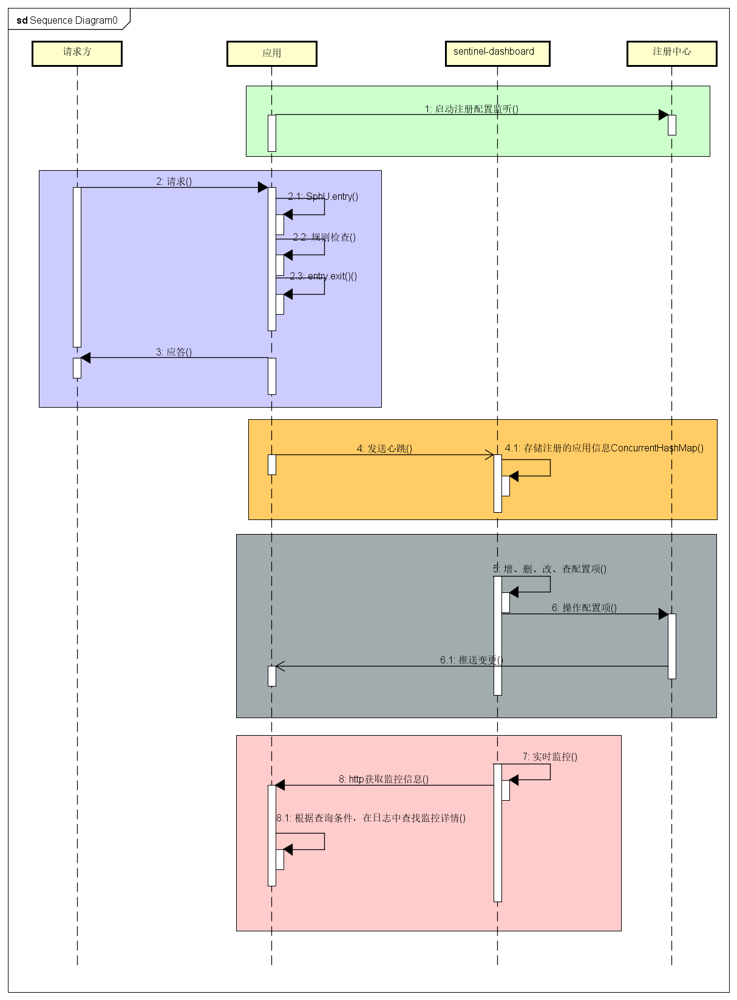
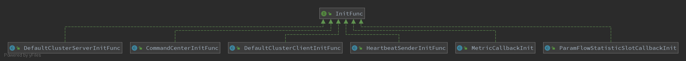
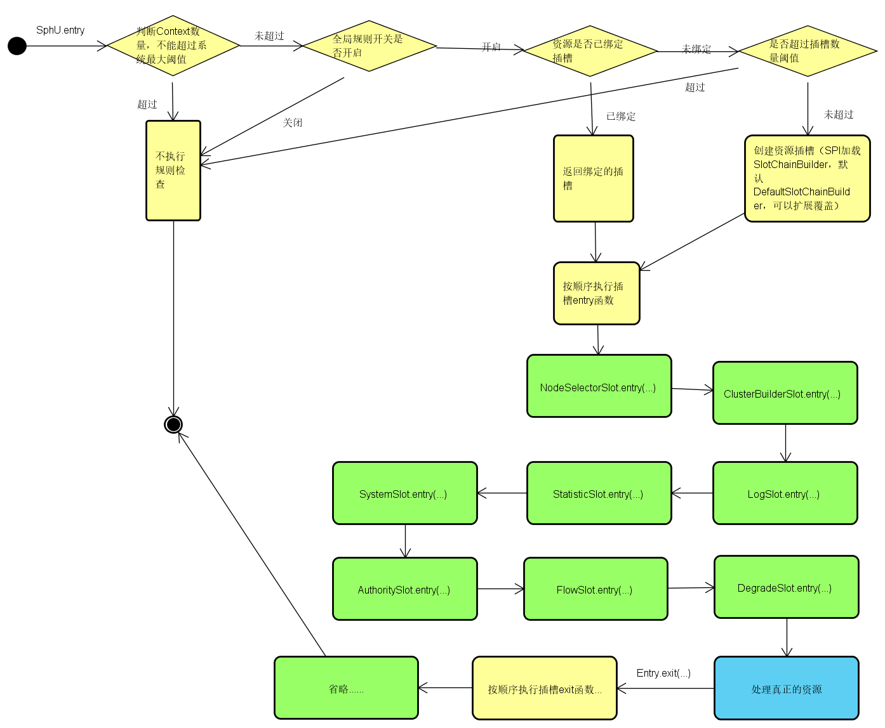
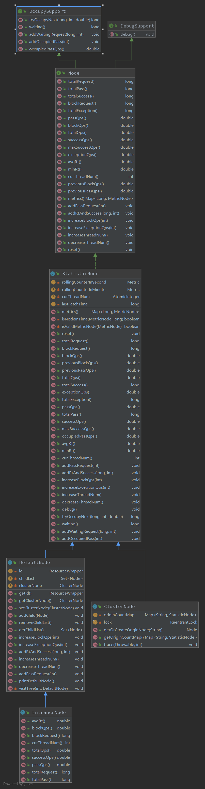
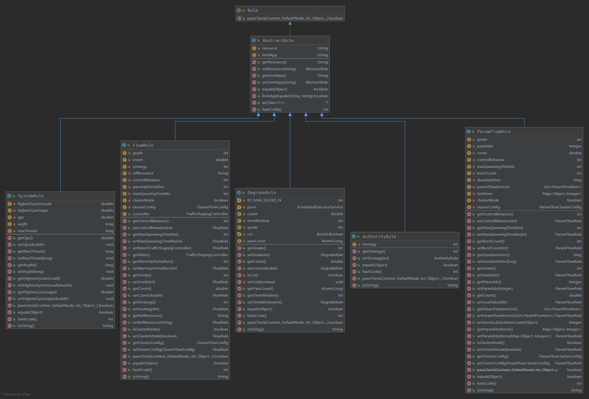

关于[Alibaba Sentinel](https://github.com/alibaba/Sentinel/wiki/%E4%BB%8B%E7%BB%8D)是什么、以及具有哪些特性、怎么使用（[Sentinel Demo 集锦](https://github.com/alibaba/Sentinel/tree/master/sentinel-demo)）等等，可以查看官方github wiki说明，这里不详细展开。

## 整体时序图

## 初始化InitFunc
框架提供InitFunc接口，用于实现首次执行时的初始化操作，因为是通过SPI机制进行加载，所有用户层可以自扩展自己的初始化操作，同时提供`@InitOrder`注解，用户控制执行顺序（越小越先执行）。

### CommandCenterInitFunc
原通过SPI机制加载`CommandCenter`插件，启动client内置的http服务（`NettyHttpCommandCenter`采用Netty实现，`SimpleHttpCommandCenter`采用原生Socket实现），用于和sentinel-dashboard服务进行通讯，比如dashboard查询节点实时监控信息。

### HeartbeatSenderInitFunc
通过SPI机制加载`HeartbeatSender`插件，唯一实现类`SimpleHttpHeartbeatSender`，用于定时向sentinel-dashboard（uri=/registry/machine）发送心跳信息。多个控制台地址格式：ip1:port1,ip2:port2...


## 定义资源执行逻辑
框架定义资源使用的是SphU.entry(...)函数，内部具体执行逻辑如下：


具体插槽功能见官方说明：[Sentinel工作主流程](https://github.com/alibaba/Sentinel/wiki/Sentinel%E5%B7%A5%E4%BD%9C%E4%B8%BB%E6%B5%81%E7%A8%8B)


## 监控信息获取
* 节点数据结构

* 滑动时间窗口 ArrayMetric
* 监控信息存储及查询 MetricTimerListener MetricSearcher

## 规则编排
默认编排实现类`DefaultSlotChainBuilder`
```
public class DefaultSlotChainBuilder implements SlotChainBuilder {

    @Override
    public ProcessorSlotChain build() {
        ProcessorSlotChain chain = new DefaultProcessorSlotChain();
        chain.addLast(new NodeSelectorSlot());
        chain.addLast(new ClusterBuilderSlot());
        chain.addLast(new LogSlot());
        chain.addLast(new StatisticSlot());
        chain.addLast(new SystemSlot());
        chain.addLast(new AuthoritySlot());
        chain.addLast(new FlowSlot());
        chain.addLast(new DegradeSlot());

        return chain;
    }
}
```
应用可以自定义实现，实现`SlotChainBuilder`接口并重写`build()`方法。

## 监控规则

### 流控规则FlowSlot
#### 基于QPS/并发数的流量控制
[官方文档-流量控制](https://github.com/alibaba/Sentinel/wiki/%E6%B5%81%E9%87%8F%E6%8E%A7%E5%88%B6)
##### QPS流量控制
> 同一个资源可以创建多条限流规则。FlowSlot 会对该资源的所有限流规则依次遍历，直到有规则触发限流或者所有规则遍历完毕。

###### 直接拒绝
默认的流量控制方式，当QPS超过任意规则的阈值后，新的请求就会被立即拒绝，拒绝方式为抛出FlowException。
###### Warm Up
预热/冷启动方式。通过"冷启动"，让通过的流量缓慢增加，在一定时间内逐渐增加到阈值上限，给冷系统一个预热的时间，避免冷系统被压垮。
###### 匀速排队
让请求以均匀的速度通过，对应的是漏桶算法。
这种方式主要用于处理间隔性突发的流量，例如消息队列。

##### 并发线程数流量控制
> 并发线程数限流不负责创建和管理线程池，而是简单统计当前请求上下文的线程数目，如果超出阈值，新的请求会被立即拒绝，效果类似于信号量隔离

#### 基于调用关系的流量控制

##### 根据调用方限流
>页面位置：流控规则->新增流控规则->流控模式->直接


流控规则中的 limitApp 字段用于根据调用来源进行流量控制。
同一个资源名可以配置多条规则，规则的生效顺序为：**{some_origin_name} > other > default**

<font color='red'>**注意：limitApp为空时则不执行流控校验** </font>
##### 根据调用链路入口限流：链路限流
>页面位置：流控规则->新增流控规则->流控模式->链路


##### 具有关系的资源流量控制：关联流量控制
>页面位置：流控规则->新增流控规则->流控模式->关联

### 降级规则DegradeSlot
[官方文档-熔断降级](https://github.com/alibaba/Sentinel/wiki/%E7%86%94%E6%96%AD%E9%99%8D%E7%BA%A7)
#### 平均响应时间
* 并不是资源平均相应时间大于设定rt时立马执行降级，而是在时间窗口1s内（`StatisticNode.avgRt()`）发生5（`DegradeRule.RT_MAX_EXCEED_N`）次，才会执行降级。
* Sentinel 默认统计的 RT 上限是 4900 ms，超出此阈值的都会算作 4900 ms，若需要变更此上限可以通过启动配置项 `-Dcsp.sentinel.statistic.max.rt=xxx` 来配置。

```
public class DegradeRule extends AbstractRule {
    ......
    @Override
    public boolean passCheck(Context context, DefaultNode node, int acquireCount, Object... args) {
        ......
        if (grade == RuleConstant.DEGRADE_GRADE_RT) {
            double rt = clusterNode.avgRt();
            if (rt < this.count) {
                passCount.set(0);
                return true;
            }

            // Sentinel will degrade the service only if count exceeds.
            if (passCount.incrementAndGet() < RT_MAX_EXCEED_N) {
                return true;
            }
        }
        ......
        // 更新降级标记位，并启动重置线程，在设定时间窗口内关闭降级开关
        if (cut.compareAndSet(false, true)) {
            ResetTask resetTask = new ResetTask(this);
            pool.schedule(resetTask, timeWindow, TimeUnit.SECONDS);
       }
       ......
}
```

```
public class StatisticSlot extends AbstractLinkedProcessorSlot<DefaultNode> {
    ......
    @Override
    public void exit(Context context, ResourceWrapper resourceWrapper, int count, Object... args) {
        ......
        if (context.getCurEntry().getError() == null) {
            // Calculate response time (max RT is TIME_DROP_VALVE).
            long rt = TimeUtil.currentTimeMillis() - context.getCurEntry().getCreateTime();
            if (rt > Constants.TIME_DROP_VALVE) {
                rt = Constants.TIME_DROP_VALVE;
            }
            ......
        }
        ......
    }
}
```

#### 异常比例
* 异常比率的阈值范围是 [0.0, 1.0]，代表 0% - 100%
* 时间窗口单位为1秒


#### 异常数
资源近 1 分钟的异常数目超过阈值之后会进行熔断。

### 系统规则SystemSlot
[官方文档-系统自适应限流](https://github.com/alibaba/Sentinel/wiki/%E7%B3%BB%E7%BB%9F%E8%87%AA%E9%80%82%E5%BA%94%E9%99%90%E6%B5%81)
Sentinel有定时机制，每隔1s检查当前系统负载情况
```
public class SystemRuleManager {
    ......
    // sentinel-dashboard配置项变更监听
    private final static SystemPropertyListener listener = new SystemPropertyListener();
    private static SentinelProperty<List<SystemRule>> currentProperty = new DynamicSentinelProperty<List<SystemRule>>();

    @SuppressWarnings("PMD.ThreadPoolCreationRule")
    private final static ScheduledExecutorService scheduler = Executors.newScheduledThreadPool(1,
        new NamedThreadFactory("sentinel-system-status-record-task", true));

    static {
        checkSystemStatus.set(false);
        // 定时监听系统负载
        statusListener = new SystemStatusListener();
        scheduler.scheduleAtFixedRate(statusListener, 5, 1, TimeUnit.SECONDS);
        currentProperty.addListener(listener);
    }
    ......
}
```
#### Load

#### RT

#### 线程数

#### 入口 QPS

### 授权规则AuthoritySlot
[官方文档-黑白名单控制](https://github.com/alibaba/Sentinel/wiki/%E9%BB%91%E7%99%BD%E5%90%8D%E5%8D%95%E6%8E%A7%E5%88%B6)
#### 白名单

#### 黑名单

### 热点规则ParamFlowSlot
[官方文档-热点参数限流](https://github.com/alibaba/Sentinel/wiki/%E7%83%AD%E7%82%B9%E5%8F%82%E6%95%B0%E9%99%90%E6%B5%81)
需要结合`public static Entry entry(Method method, EntryType type, int count, Object... args) throws BlockException`等含有`Object... args`参数的方法使用。
主要用于热点数据限流。

### 集群流控ClusterBuilderSlot
