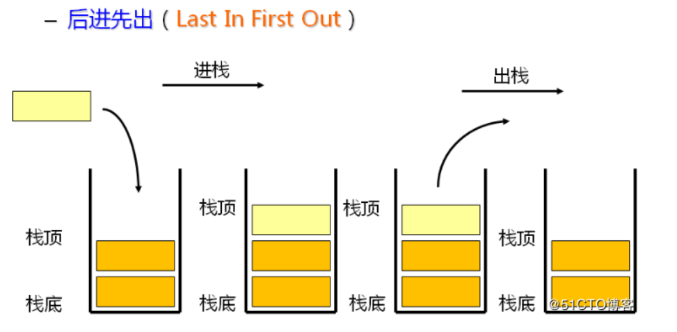
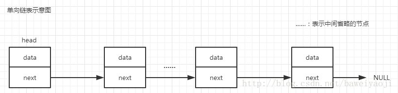
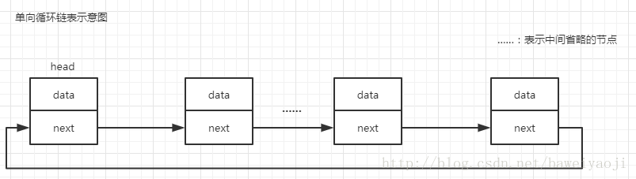
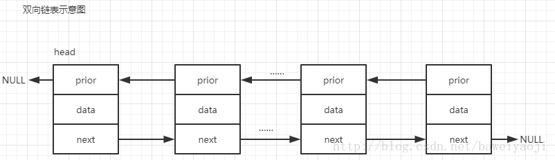
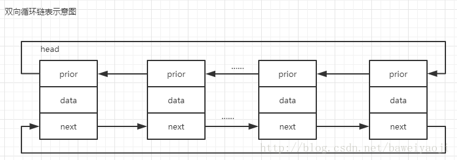
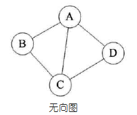
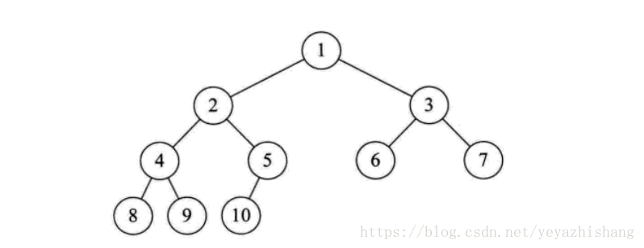
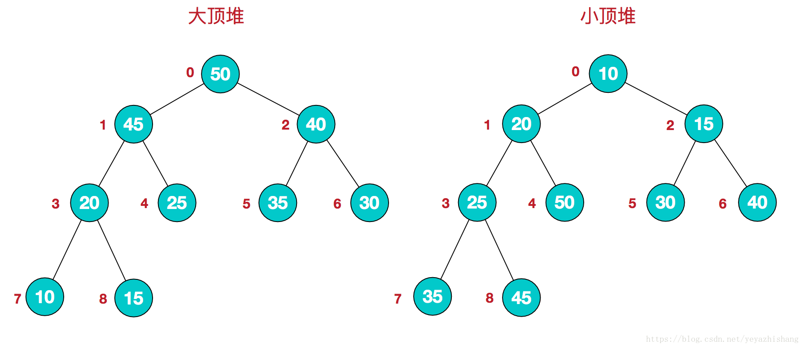
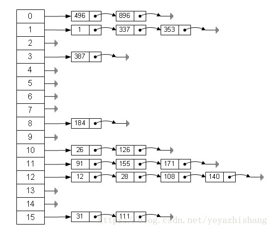
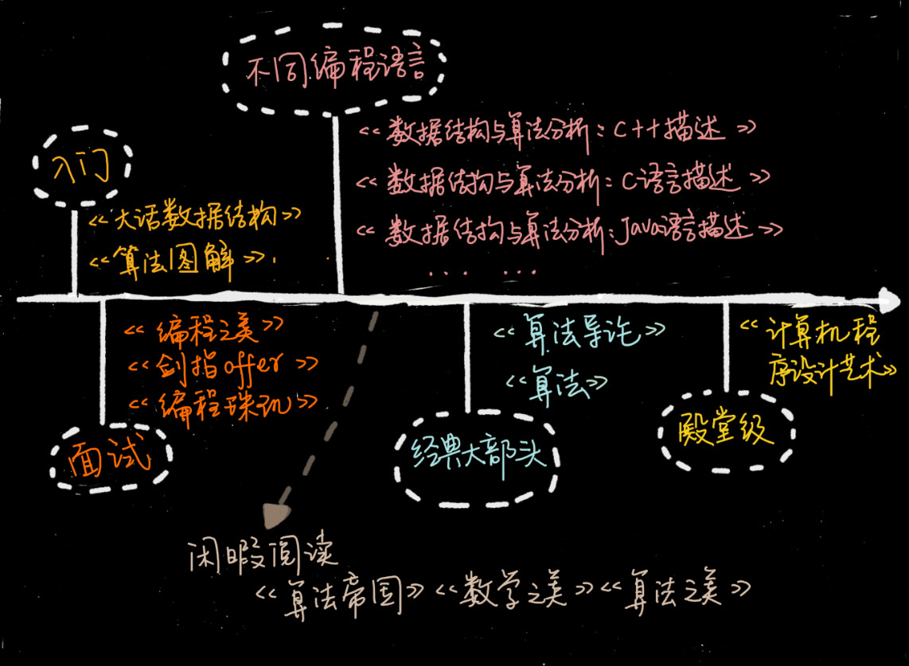

参考：[数据结构：八大数据结构分类](https://blog.csdn.net/yeyazhishang/article/details/82353846)、[(单向、单向循环、双向、双向循环)链表学习总结](https://blog.csdn.net/baweiyaoji/article/details/76071053)
> 数据结构是为算法服务的，算法要作用在特定的数据结构之上
> 想要学习数据结构与算法，首先要掌握一个**数据结构与算法中最重要的概念-复杂度分析**

10 个常用数据结构：数组、链表、栈、队列、散列表、二叉树、堆、跳表、图、Trie树
10个常用算法：递归、排序、二分查找、搜索、哈希算法、贪心算法、分治算法、回溯算法、动态规划、字符串匹配算法
## 数组
* **介绍**：
1. 可以在内存中连续分配的数据结构
2. 元素通过下标进行访问
* **优点**：
1. 按照索引查询速度快
2. 按照索引遍历方便
* **缺点**：
1. 元素删除、新增操作慢，需要移动其他元素
2. 只能存储单一类型的元素
3. 容量在初始化时确定下来，无法扩容
* **适用场景**：
1. 查询频繁，删除、新增操作少，对存储空间要求不大

## 栈
* **介绍**：
1. 一种特殊的线性表，只能在线性表的一端操作
2. 栈顶允许操作，栈底不能操作
3. 特点先进后出
4. 栈顶放入元素成为入栈（PUSH），取出元素称为出栈（POP）

* **优点**：

* **缺点**：

* **适用场景**：
1. 递归等场景

## 链表
* **介绍**：
1. 物理存储单元上非连续、非顺序的存储结构
2. 数据元素的逻辑顺序是通过链表指针实现的
3. 每个元素包含两个节点：一个存储元素的数据域，一个指向下一个节点的指针域
4. 根据指针的指向，可以分为：单链表、双向链表、循环链表

* **优点**：
1. 不需要初始化，可以随意添加、删除元素
2. 添加、删除只需要修改改变前后两个节点的指针域指向地址即可，所有添加、删除操作速度快
* **缺点**：
1. 因含有指针域，所以占用空间大
2. 查询元素比较耗时，需要遍历整个链表
* **适用场景**：
1. 数据量小，但是需要频繁添加、删除的场景

## 队列
* **介绍**：
1. 一种线性表
2. 可以在一端添加元素，另一端取出元素，即先进先出
* **优点**：

* **缺点**：

* **适用场景**：
1. 阻塞队列

## 图
* **介绍**：
 &#160; &#160;图是由结点的有穷集合V和边的集合E组成。其中，为了与树形结构加以区别，在图结构中常常将结点称为顶点，边是顶点的有序偶对，若两个顶点之间存在一条边，就表示这两个顶点具有相邻关系。
按照顶点指向的方向可分为无向图和有向图：

 &#160; &#160;图是一种比较复杂的数据结构，在存储数据上有着比较复杂和高效的算法，分别有邻接矩阵 、邻接表、十字链表、邻接多重表、边集数组等存储结构

## 树
* **介绍**：
1. 由n(n>=1)个元素组成的具有层次关系的集合
2. 每个节点有零或者多个子节点
3. 没有父节点的节点为根节点
4. 每一个非根节点有且只有一个根节点
5. 除了根节点，每个子节点可以分为多个不相交的子树

## 堆
* **介绍**：
堆的定义如下：n个元素的序列{k1,k2,ki,…,kn}当且仅当满足下关系时，称之为堆
1. 比较特殊的数据结构，可以被看做一棵树的数组对象
2. 堆中某个节点的值总是不大于或不小于其父节点的值
3. 堆总是一棵完全二叉树
4. 根节点最大的堆叫做最大堆或大根堆，根节点最小的堆叫做最小堆或小根堆。常见的堆有二叉堆、斐波那契堆等
5. 满足(ki <= k2i,ki <= k2i+1)称为小顶堆
6. 满足(ki >= k2i,ki >= k2i+1)称为大顶堆

## 散列表
* **介绍**：
 &#160; &#160;散列表，也叫哈希表，是根据关键码和值 (key和value) 直接进行访问的数据结构，通过key和value来映射到集合中的一个位置，这样就可以很快找到集合中的对应元素。
**记录的存储位置=f(key)**
 &#160; &#160;这里的对应关系 f 成为散列函数，又称为哈希 (hash函数)，而散列表就是把Key通过一个固定的算法函数既所谓的哈希函数转换成一个整型数字，然后就将该数字对数组长度进行取余，取余结果就当作数组的下标，将value存储在以该数字为下标的数组空间里，这种存储空间可以充分利用数组的查找优势来查找元素，所以查找的速度很快。
 &#160; &#160;哈希表在应用中也是比较常见的，就如Java中有些集合类就是借鉴了哈希原理构造的，例如HashMap，HashTable等，利用hash表的优势，对于集合的查找元素时非常方便的，然而，因为哈希表是基于数组衍生的数据结构，在添加删除元素方面是比较慢的，所以很多时候需要用到一种数组链表来做，也就是拉链法。拉链法是数组结合链表的一种结构，较早前的hashMap底层的存储就是采用这种结构，直到jdk1.8之后才换成了数组加红黑树的结构，其示例图如下：

 &#160; &#160;从图中可以看出，左边很明显是个数组，数组的每个成员包括一个指针，指向一个链表的头，当然这个链表可能为空，也可能元素很多。我们根据元素的一些特征把元素分配到不同的链表中去，也是根据这些特征，找到正确的链表，再从链表中找出这个元素。
哈希表的应用场景很多，当然也有很多问题要考虑，比如哈希冲突的问题，如果处理的不好会浪费大量的时间，导致应用崩溃。
* **优点**：
1. 查找速度快
* **缺点**：

* **适用场景**：

## 学习书籍推荐

