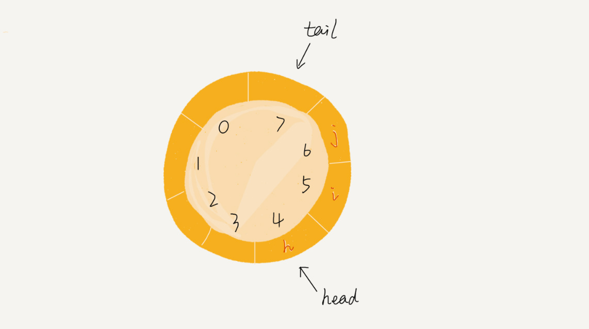
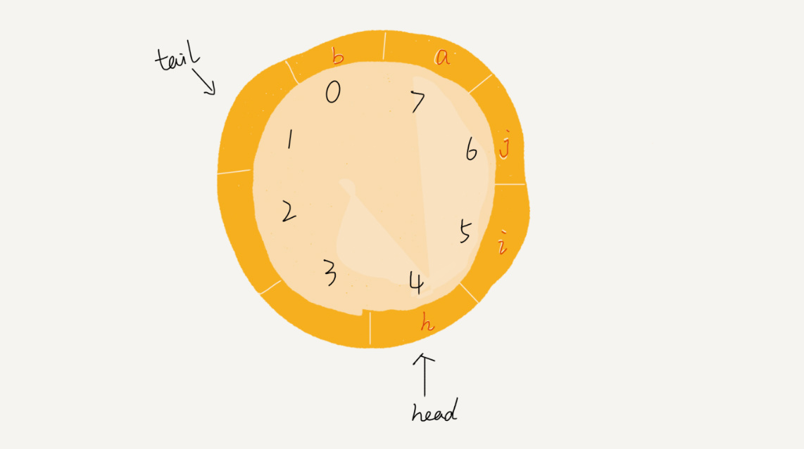

参考：[09 | 队列：队列在线程池等有限资源池中的应用](https://time.geekbang.org/column/article/41330)

队列跟栈一样，也是一种**操作受限的线性表数据结构**。可以把它想象成排队买票，先来的先买，后来的人只能站末尾，不允许插队。**先进者先出，这就是典型的“队列”**。


两个基本操作：
* 入队 enqueue()，放一个数据到队列尾部
* 出队 dequeue()，从队列头部取一个元素


 &#160; &#160;队列的概念很好理解，基本操作也很容易掌握。作为一种非常基础的数据结构，队列的应用也非常广泛，特别是一些具有某些额外特性的队列，比如循环队列、阻塞队列、并发队列。它们在很多偏底层系统、框架、中间件的开发中，起着关键性的作用。比如高性能队列 Disruptor、Linux 环形缓存，都用到了循环并发队列；Java concurrent 并发包利用 ArrayBlockingQueue 来实现公平锁等。

## 顺序队列和链式队列
 &#160; &#160;跟栈一样，队列可以用数组来实现，也可以用链表来实现。用数组实现的栈叫作顺序栈，用链表实现的栈叫作链式栈。同样，用数组实现的队列叫作**顺序队列**，用链表实现的队列叫作**链式队列**。
### 顺序队列
```java
// 用数组实现的队列
public class ArrayQueue {
  // 数组：items，数组大小：n
  private String[] items;
  private int n = 0;
  // head 表示队头下标，tail 表示队尾下标
  private int head = 0;
  private int tail = 0;

  // 申请一个大小为 capacity 的数组
  public ArrayQueue(int capacity) {
    items = new String[capacity];
    n = capacity;
  }

  // 入队
  public boolean enqueue(String item) {
    // 如果 tail == n 表示队列已经满了
    if (tail == n) return false;
    items[tail] = item;
    ++tail;
    return true;
  }

  // 出队
  public String dequeue() {
    // 如果 head == tail 表示队列为空
    if (head == tail) return null;
    // 为了让其他语言的同学看的更加明确，把 -- 操作放到单独一行来写了
    String ret = items[head];
    ++head;
    return ret;
  }
}
```
对于栈来说，我们只需要一个栈顶指针就可以了。但是队列需要两个指针：一个是 head 指针，指向队头；一个是 tail 指针，指向队尾。

你可以结合下面这幅图来理解。当 a、b、c、d 依次入队之后，队列中的 head 指针指向下标为 0 的位置，tail 指针指向下标为 4 的位置。

当我们调用两次出队操作之后，队列中 head 指针指向下标为 2 的位置，tail 指针仍然指向下标为 4 的位置。

 &#160; &#160;随着不停地进行入队、出队操作，head 和 tail 都会持续往后移动。当 tail 移动到最右边，即使数组中还有空闲空间，也无法继续往队列中添加数据了。这个问题该如何解决呢？
 &#160; &#160;实际上，我们在出队时可以不用搬移数据。如果没有空闲空间了，我们只需要在入队时，再集中触发一次数据的搬移操作。借助这个思想，出队函数 dequeue() 保持不变，我们稍加改造一下入队函数 enqueue() 的实现，就可以轻松解决刚才的问题了。下面是具体的代码：
```java
// 入队操作，将 item 放入队尾
public boolean enqueue(String item) {
 // tail == n 表示队列末尾没有空间了
 if (tail == n) {
   // tail ==n && head==0，表示整个队列都占满了
   if (head == 0) return false;
   // 数据搬移
   for (int i = head; i < tail; ++i) {
     items[i-head] = items[i];
   }
   // 搬移完之后重新更新 head 和 tail
   tail -= head;
   head = 0;
 }

 items[tail] = item;
 ++tail;
 return true;
}
```
 &#160; &#160;从代码中我们看到，当队列的 tail 指针移动到数组的最右边后，如果有新的数据入队，我们可以将 head 到 tail 之间的数据，整体搬移到数组中 0 到 tail-head 的位置。

### 链式队列
基于链表的实现，我们同样需要两个指针：head 指针和 tail 指针。它们分别指向链表的第一个结点和最后一个结点。如图所示，入队时，tail->next= new_node, tail = tail->next；出队时，head = head->next。


## 循环队列
上面用数组来实现队列的时候，在 tail==n 时，会有数据搬移操作，这样入队操作性能就会受到影响。那有没有办法能够避免数据搬移呢？我们来看看循环队列的解决思路。
循环队列，顾名思义，它长得像一个环。原本数组是有头有尾的，是一条直线。现在我们把首尾相连，扳成了一个环。我画了一张图，你可以直观地感受一下。

我们可以看到，图中这个队列的大小为 8，当前 head=4，tail=7。当有一个新的元素 a 入队时，我们放入下标为 7 的位置。但这个时候，我们并不把 tail 更新为 8，而是将其在环中后移一位，到下标为 0 的位置。当再有一个元素 b 入队时，我们将 b 放入下标为 0 的位置，然后 tail 加 1 更新为 1。所以，在 a，b 依次入队之后，循环队列中的元素就变成了下面的样子：

通过这样的方法，我们成功避免了数据搬移操作。看起来不难理解，但是循环队列的代码实现难度要比前面讲的非循环队列难多了。要想写出没有 bug 的循环队列的实现代码，我个人觉得，最关键的是，**确定好队空和队满的判定条件**。
在用数组实现的非循环队列中，队满的判断条件是 tail == n，队空的判断条件是 head == tail。那针对循环队列，如何判断队空和队满呢？
**队列为空的判断条件仍然是 head == tail**。但队列满的判断条件就稍微有点复杂了。我画了一张队列满的图，你可以看一下，试着总结一下规律。


就像我图中画的队满的情况，tail=3，head=4，n=8，所以总结一下规律就是：(3+1)%8=4。多画几张队满的图，你就会发现，**队列满的判断条件是(tail+1)%n=head**。
你有没有发现，当队列满时，图中的 tail 指向的位置实际上是没有存储数据的。所以，循环队列会浪费一个数组的存储空间。
```java
public class CircularQueue {
  // 数组：items，数组大小：n
  private String[] items;
  private int n = 0;
  // head 表示队头下标，tail 表示队尾下标
  private int head = 0;
  private int tail = 0;

  // 申请一个大小为 capacity 的数组
  public CircularQueue(int capacity) {
    items = new String[capacity];
    n = capacity;
  }

  // 入队
  public boolean enqueue(String item) {
    // 队列满了
    if ((tail + 1) % n == head) return false;
    items[tail] = item;
    tail = (tail + 1) % n;
    return true;
  }

  // 出队
  public String dequeue() {
    // 如果 head == tail 表示队列为空
    if (head == tail) return null;
    String ret = items[head];
    head = (head + 1) % n;
    return ret;
  }
}
```

## 阻塞队列和并发队列

**阻塞队列** 其实就是在队列基础上增加了阻塞操作。简单来说，就是在队列为空的时候，从队头取数据会被阻塞。因为此时还没有数据可取，直到队列中有了数据才能返回；如果队列已经满了，那么插入数据的操作就会被阻塞，直到队列中有空闲位置后再插入数据，然后再返回。


通过阻塞队列实现**生产者-消费者**模型


 &#160; &#160;阻塞队列在多线程情况下，会有多个线程同时操作队列，这个时候就会存在线程安全问题，那如何实现一个线程安全的队列呢？
 &#160; &#160;线程安全的队列我们叫作**并发队列**。最简单直接的实现方式是直接在 enqueue()、dequeue() 方法上加锁，但是锁粒度大并发度会比较低，同一时刻仅允许一个存或者取操作。实际上，基于数组的循环队列，利用 CAS 原子操作，可以实现非常高效的并发队列。这也是循环队列比链式队列应用更加广泛的原因。例如： Disruptor 。

## 思考

线程池没有空闲线程时，新的任务请求线程资源时，线程池该如何处理？各种处理策略又是如何实现的呢？
* 第一种是非阻塞的处理方式，直接拒绝任务请求；
* 另一种是阻塞的处理方式，将请求排队，等到有空闲线程时，取出排队的请求继续处理。那如何存储排队的请求呢？


 &#160; &#160;我们希望公平地处理每个排队的请求，先进者先服务，所以队列这种数据结构很适合来存储排队请求。我们前面说过，队列有基于链表和基于数组这两种实现方式。这两种实现方式对于排队请求又有什么区别呢？
* 基于链表的实现方式，可以实现一个支持无限排队的无界队列（unbounded queue），但是可能会导致过多的请求排队等待，请求处理的响应时间过长。所以，针对响应时间比较敏感的系统，基于链表实现的无限排队的线程池是不合适的。
* 而基于数组实现的有界队列（bounded queue），队列的大小有限，所以线程池中排队的请求超过队列大小时，接下来的请求就会被拒绝，这种方式对响应时间敏感的系统来说，就相对更加合理。不过，设置一个合理的队列大小，也是非常有讲究的。队列太大导致等待的请求太多，队列太小会导致无法充分利用系统资源、发挥最大性能。


 &#160; &#160;除了前面讲到队列应用在线程池请求排队的场景之外，队列可以应用在任何有限资源池中，用于排队请求，比如数据库连接池等。**实际上，对于大部分资源有限的场景，当没有空闲资源时，基本上都可以通过“队列”这种数据结构来实现请求排队。**
