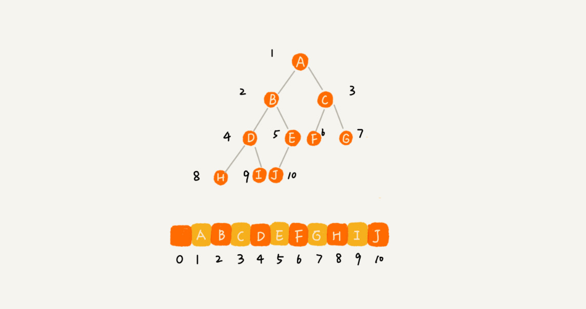

参考：[极客时间树相关知识](https://time.geekbang.org/column/article/67856)

## 二叉树
> 每个节点最多有两个“叉”，也就是两个子节点，分别是左子节点和右节点


* **满二叉树**：编号 2 的二叉树中，叶子节点全都在最底层，除了叶子节点之外，每个节点都有左右两个子节点，这种二叉树就叫作满二叉树。
* **完全二叉树**：编号 3 的二叉树中，叶子节点都在最底下两层，最后一层的叶子节点都靠左排列，并且除了最后一层，其他层的节点个数都要达到最大。

### 存储方式

#### 链式存储法

每个节点有三个字段，其中一个存储数据，另外两个是指向左右子节点的指针。我们只要拎住根节点，就可以通过左右子节点的指针，把整棵树都串起来。
#### 顺序存储法

1. 把根节点存储在下标 i = 1 的位置，
2. 那左子节点存储在下标2 \* i = 2 的位置，
3. 右子节点存储在 2 \* i + 1= 3 的位置。
4. 以此类推，B 节点的左子节点存储在 2 \* i = 2 \* 2 = 4 的位置，右子节点存储在 2 \* i + 1 = 2 \* 2 + 1 = 5 的位置。

### 遍历方式
> 遍历的时间复杂度是 O(n)
> 需要理解并能用递归代码来实现


#### 前序遍历
对于树中的任意节点来说，先打印这个节点，然后再打印它的左子树，最后打印它的右子树。
#### 中序遍历
对于树中的任意节点来说，先打印它的左子树，然后再打印它本身，最后打印它的右子树。
#### 后序遍历
对于树中的任意节点来说，先打印它的左子树，然后再打印它的右子树，最后打印这个节点本身。


#### 遍历伪代码
```
void preOrder(Node* root) {
  if (root == null) return;
  print root // 此处为伪代码，表示打印 root 节点
  preOrder(root->left);
  preOrder(root->right);
}

void inOrder(Node* root) {
  if (root == null) return;
  inOrder(root->left);
  print root // 此处为伪代码，表示打印 root 节点
  inOrder(root->right);
}

void postOrder(Node* root) {
  if (root == null) return;
  postOrder(root->left);
  postOrder(root->right);
  print root // 此处为伪代码，表示打印 root 节点
}
```

## 二叉查找树
> 定义：二叉查找树要求，在树中的任意一个节点，其左子树中的每个节点的每个节点的值，都要小于这个节点的值，而右子树节点的值都大于这个节点的值。


### 查找
```
public class BinarySearchTree {
  private Node tree;

  public Node find(int data) {
    Node p = tree;
    while (p != null) {
      if (data < p.data) p = p.left;
      else if (data > p.data) p = p.right;
      else return p;
    }
    return null;
  }

  public static class Node {
    private int data;
    private Node left;
    private Node right;

    public Node(int data) {
      this.data = data;
    }
  }
}
```
### 插入
```
public void insert(int data) {
  if (tree == null) {
    tree = new Node(data);
    return;
  }

  Node p = tree;
  while (p != null) {
    if (data > p.data) {
      if (p.right == null) {
        p.right = new Node(data);
        return;
      }
      p = p.right;
    } else { // data < p.data
      if (p.left == null) {
        p.left = new Node(data);
        return;
      }
      p = p.left;
    }
  }
}
```
### 删除
删除操作比较复杂，可以分为三种情况：
1. 要删除的节点没有子节点：我们只需要直接将父节点中，指向要删除节点的指针置为 null。比如图中的删除节点 55。
2. 要删除的节点只有一个子节点（只有左子节点或者右子节点）：我们只需要更新父节点中，指向要删除节点的指针，让它指向要删除节点的子节点就可以了。比如图中的删除节点 13。
3. 要删除的节点有两个子节点：需要找到这个节点的右子树中的最小节点，把它替换到要删除的节点上。然后再删除掉这个最小节点，因为最小节点肯定没有左子节点（如果有左子结点，那就不是最小节点了），所以，我们可以应用上面两条规则来删除这个最小节点。比如图中的删除节点 18。

