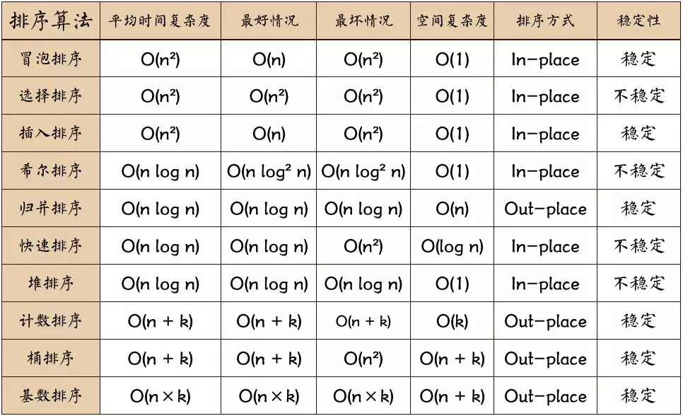

## 基础
### 术语说明
* **稳定**：如果a原本在b前面，而a=b，排序之后a仍然在b的前面；
* **不稳定**：如果a原本在b的前面，而a=b，排序之后a可能会出现在b的后面；
* **内排序**：所有排序操作都在内存中完成；
* **外排序**：由于数据太大，因此把数据放在磁盘中，而排序通过磁盘和内存的数据传输才能进行；
* **时间复杂度**： 一个算法执行所耗费的时间。
* **空间复杂度**：运行完一个程序所需内存的大小。

### 算法复杂度


名词解释：
* n: 数据规模
* k: “桶”的个数
* In-place: 占用常数内存，不占用额外内存
* Out-place: 占用额外内存


## 冒泡排序（Bubble Sort）
### 描述
1. 比较相邻的元素。如果第一个比第二个大，就交换它们两个；
2. 对每一对相邻元素作同样的工作，从开始第一对到结尾的最后一对，这样在最后的元素应该会是最大的数；
3. 针对所有的元素重复以上的步骤，除了最后一个；
4. 重复步骤1~3，直到排序完成。


## 选择排序（Selection Sort）
表现最稳定的排序算法之一，因为无论什么数据进去都是O(n²)的时间复杂度，所以用到它的时候，数据规模越小越好。

选择排序(Selection-sort)是一种简单直观的排序算法。它的工作原理：首先在未排序序列中找到最小（大）元素，存放到排序序列的起始位置，然后，再从剩余未排序元素中继续寻找最小（大）元素，然后放到已排序序列的末尾。以此类推，直到所有元素均排序完毕。
### 描述
1. 初始状态：无序区为R[1..n]，有序区为空；
2. 第i趟排序(i=1,2,3…n-1)开始时，当前有序区和无序区分别为R[1..i-1]和R(i..n）。该趟排序从当前无序区中-选出关键字最小的记录 R[k]，将它与无序区的第1个记录R交换，使R[1..i]和R[i+1..n)分别变为记录个数增加1个的新有序区和记录个数减少1个的新无序区；
3. n-1趟结束，数组有序化了。

### 代码
```java
    public void selectSort() {
        if (data == null || data.length == 0) {
            return;
        }
        // 外层循环：对未排序空间逐步迭代
        for (int i = 0; i < data.length; i++) {
            int minIndex = i;
            // 内层循环：在未排序空间查找最小元素索引
            for (int j = i; j < data.length; j++) {
                if (data[minIndex] > data[j]) {
                    minIndex = j;
                }
            }
            int tmp = data[i];
            data[i] = data[minIndex];
            data[minIndex] = tmp;
        }
        System.out.println(Arrays.deepToString(data));
    }
```
## 插入排序（Insertion Sort）
工作原理是通过构建有序序列，对于未排序数据，在已排序序列中从后向前扫描，找到相应位置并插入。插入排序在实现上，通常采用in-place排序（即只需用到O(1)的额外空间的排序），因而在从后向前扫描过程中，需要反复把已排序元素逐步向后挪位，为最新元素提供插入空间。
### 描述
1. 从第一个元素开始，该元素可以认为已经被排序；
2. 取出下一个元素，在已经排序的元素序列中从后向前扫描；
3. 如果该元素（已排序）大于新元素，将该元素移到下一位置；
4. 重复步骤3，直到找到已排序的元素小于或者等于新元素的位置；
5. 将新元素插入到该位置后；
6. 重复步骤2~5。

### 代码
```java
    /**
     * 插入排序
     */
    public Integer[] insertionSort(Integer[] data) {
        for (int i = 0; i < data.length - 1; i++) {
            int preIndex = i;
            int value = data[i + 1];
            while (preIndex >= 0 && value < data[preIndex]) {
                data[preIndex + 1] = data[preIndex];
                preIndex--;
            }
            data[preIndex + 1] = value;
        }
        return data;
    }
```
## 希尔排序（Shell Sort）
希尔排序是希尔（Donald Shell）于1959年提出的一种排序算法。希尔排序也是一种插入排序，它是简单插入排序经过改进之后的一个更高效的版本，也称为缩小增量排序，同时该算法是冲破O(n2）的第一批算法之一。它与插入排序的不同之处在于，它会优先比较距离较远的元素。希尔排序又叫缩小增量排序。

**希尔排序是把记录按下表的一定增量分组，对每组使用直接插入排序算法排序；随着增量逐渐减少，每组包含的关键词越来越多，当增量减至1时，整个文件恰被分成一组，算法便终止。**

我们来看下希尔排序的基本步骤，在此我们选择增量gap=length/2，缩小增量继续以gap = gap/2的方式，这种增量选择我们可以用一个序列来表示，{n/2,(n/2)/2...1}，称为增量序列。希尔排序的增量序列的选择与证明是个数学难题，我们选择的这个增量序列是比较常用的，也是希尔建议的增量，称为希尔增量，但其实这个增量序列不是最优的。此处我们做示例使用希尔增量。

> 整个待排序的记录序列分割成为若干子序列分别进行直接插入排序


### 描述
1. 选择一个增量序列t1，t2，…，tk，其中ti>tj，tk=1；
1. 按增量序列个数k，对序列进行k 趟排序；
2. 每趟排序，根据对应的增量ti，将待排序列分割成若干长度为m 的子序列，分别对各子表进行直接插入排序。仅增量因子为1 时，整个序列作为一个表来处理，表长度即为整个序列的长度。


### 代码
```java
    /**
     * 希尔排序
     */
    public Integer[] shellSort(Integer[] array) {
        int len = array.length;
        int temp, gap = len / 2;
        while (gap > 0) {
            for (int i = gap; i < len; i++) {
                temp = array[i];
                int preIndex = i - gap;
                while (preIndex >= 0 && array[preIndex] > temp) {
                    array[preIndex + gap] = array[preIndex];
                    preIndex -= gap;
                }
                array[preIndex + gap] = temp;
            }
            gap /= 2;
        }
        return array;
    }
```
## 归并排序（Merge Sort）
和选择排序一样，归并排序的性能不受输入数据的影响，但表现比选择排序好的多，因为始终都是O(n log n）的时间复杂度。代价是需要额外的内存空间。

归并排序是建立在归并操作上的一种有效的排序算法。该算法是采用**分治法**（Divide and Conquer）的一个非常典型的应用。归并排序是一种稳定的排序方法。将已有序的子序列合并，得到完全有序的序列；即先使每个子序列有序，再使子序列段间有序。若将两个有序表合并成一个有序表，称为2-路归并。
> 分治算法一般都是用递归来实现的，分治是一种解决问题的处理思想，递归是一种编程技巧


### 描述
1. 把长度为n的输入序列分成两个长度为n/2的子序列；
2. 对这两个子序列分别采用归并排序；
3. 将两个排序好的子序列合并成一个最终的排序序列。


### 代码
```java
    /**
     * 归并排序
     */
    public Integer[] mergeSort(Integer[] data) {
        if (data.length < 2) return data;
        int mid = data.length / 2;
        Integer[] left = Arrays.copyOfRange(data, 0, mid);
        Integer[] right = Arrays.copyOfRange(data, mid, data.length);
        return merge(mergeSort(left), mergeSort(right));
    }

    /**
     * 归并排序——将两段排序好的数组结合成一个排序数组
     *
     * @param left
     * @param right
     * @return
     */
    public Integer[] merge(Integer[] left, Integer[] right) {
        Integer[] result = new Integer[left.length + right.length];
        for (int index = 0, i = 0, j = 0; index < result.length; index++) {
            if (i >= left.length)
                result[index] = right[j++];
            else if (j >= right.length)
                result[index] = left[i++];
            else if (left[i] > right[j])
                result[index] = right[j++];
            else
                result[index] = left[i++];
        }
        return result;
    }
```
## 快速排序（Quick Sort）
快速排序的基本思想：通过一趟排序将待排记录分隔成独立的两部分，其中一部分记录的关键字均比另一部分的关键字小，则可分别对这两部分记录继续进行排序，以达到整个序列有序。
### 思想
1. 从数列中挑出一个元素，称为 “基准”（pivot）；
2. 重新排序数列，所有元素比基准值小的摆放在基准前面，所有元素比基准值大的摆在基准的后面（相同的数可以到任一边）。在这个分区退出之后，该基准就处于数列的中间位置。这个称为分区（partition）操作；
3. 递归地（recursive）把小于基准值元素的子数列和大于基准值元素的子数列排序。


### 代码
```java
    /**
     * 快速排序方法
     *
     * @param array
     * @param start
     * @param end
     * @return
     */
    public Integer[] quickSort(Integer[] array, int start, int end) {
        if (array.length < 1 || start < 0 || end >= array.length || start > end) {
            return null;
        }
        int smallIndex = partition(array, start, end);
        if (smallIndex > start) {
            quickSort(array, start, smallIndex - 1);
        }
        if (smallIndex < end) {
            quickSort(array, smallIndex + 1, end);
        }
        return array;
    }

    /**
     * 快速排序算法——partition
     *
     * @param array
     * @param start
     * @param end
     * @return
     */
    public int partition(Integer[] array, int start, int end) {
        int pivot = (int) (start + Math.random() * (end - start + 1));
        int smallIndex = start - 1;
        swap(array, pivot, end);
        for (int i = start; i <= end; i++) {
            if (array[i] <= array[end]) {
                smallIndex++;
                if (i > smallIndex) {
                    swap(array, i, smallIndex);
                }
            }
        }
        return smallIndex;
    }

    /**
     * 交换数组内两个元素
     *
     * @param array
     * @param i
     * @param j
     */
    public void swap(Integer[] array, int i, int j) {
        int temp = array[i];
        array[i] = array[j];
        array[j] = temp;
    }
```

## 堆排序

## 计数排序

## 桶排序

## 基数排序
